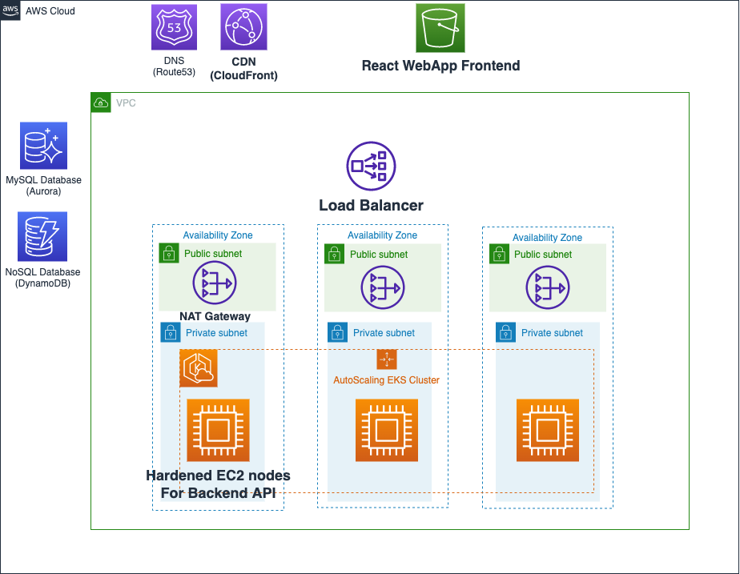
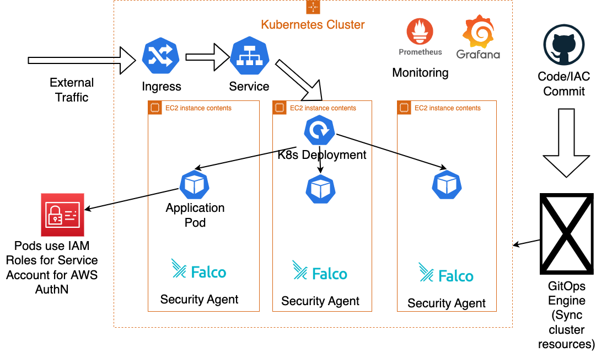

# Starship Inc
This repository contains the blueprint of Starship Inc application

## Architecture

### Cloud Architecture

### K8s Architecture

## Implementation
- Folder `terraform` contains the Terraform code to build the cloud infrastructure
- Folder `k8s` contains the Kubernetes manifests for deploying a simple Golang application
